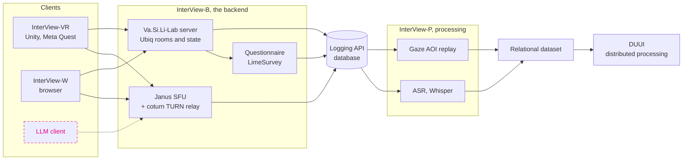
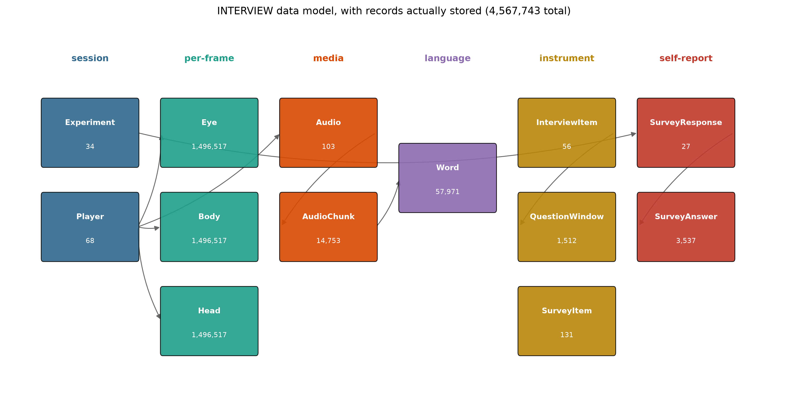
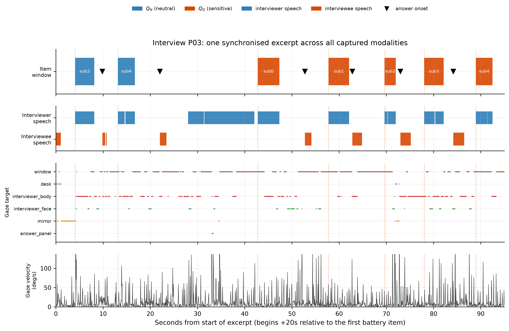

# Deliverables

Everything FACES has built is open source and public. Four repositories, each
with its own documentation site; this page explains how they fit together.
{ .lead }

| Component | What it is | Repository | Docs |
|---|---|---|---|
| **InterView** | The interview platform. A Docker Compose stack that runs the whole system. | [texttechnologylab/InterView](https://github.com/texttechnologylab/InterView) | [Docs](https://texttechnologylab.github.io/InterView/) · [here](interview.md) |
| **Va.Si.Li-Lab** | The Unity VR framework InterView's headset client is built on. | [texttechnologylab/Va.Si.Li-Lab](https://github.com/texttechnologylab/Va.Si.Li-Lab) | [Docs](https://texttechnologylab.github.io/Va.Si.Li-Lab/) · [here](vasili-lab.md) |
| **Va.Si.Li-Lab-backend** | Scene, level and role definitions, the logging API, the Ubiq room server, and optional chatbot and speech services. | [texttechnologylab/Va.Si.Li-Lab-backend](https://github.com/texttechnologylab/Va.Si.Li-Lab-backend) | [Docs](https://texttechnologylab.github.io/Va.Si.Li-Lab-backend/) · [here](vasili-lab.md#the-backend) |
| **Janus-Gateway** | A pinned, reproducible container build of the Janus WebRTC server. | [texttechnologylab/Janus-Gateway](https://github.com/texttechnologylab/Janus-Gateway) | [Docs](https://texttechnologylab.github.io/Janus-Gateway/) · [here](infrastructure.md) |

## How the pieces fit together

Clients of any type join a **room**. Janus negotiates the audio and video
streams between them and carries a control data channel; the Va.Si.Li-Lab
server synchronises the environment, the avatars and the state of the
questionnaire. Everything either of them produces is written through the
logging API. **InterView-P** then collects each completed interview, transcribes
the audio, resolves gaze against the geometry of the scene, imports the
questionnaire responses, and links them all into one relational dataset, which
can be handed on to [DUUI](https://github.com/texttechnologylab/DockerUnifiedUIMAInterface)
for distributed multimodal processing.

The **LLM client** is drawn dashed because it is designed and supported by the
backend but was not part of the evaluation study. See requirement (G) on the
[Project](../project.md#system-requirements-and-where-they-stand) page.

## The data model

The point of the architecture is what comes out of it. Interview data is not
stored as isolated question–answer pairs with metadata attached; questionnaire
items, multimodal recordings and contextual signals are nodes, and their
temporal and behavioural relations are links.

<figure markdown>
  { loading=lazy }
  <figcaption>
    <strong>The data model, with the records actually stored.</strong> Six
    entity groups, 4,567,743 records, from the 27 interviews of the evaluation
    study. Eye, body and head are sampled per frame at 1,496,517 records each;
    57,971 transcribed words link to 14,753 audio chunks; 1,512 question windows
    tie the questionnaire to the timeline; 3,537 survey answers close the loop
    to self-report. Every count in this diagram is read out of the live
    database, not estimated.
  </figcaption>
</figure>

Because the modalities share a clock and a set of links, questions can be asked
across them that no single stream could answer on its own: what a respondent
was looking at while answering a particular item, how long they took, whether
their fixation pattern shifted, and whether any of that lines up with what they
later said about the experience. [Studies](../studies.md) shows what that makes
visible.

<figure markdown>
  { loading=lazy }
  <figcaption>
    <strong>One clock.</strong> The separate streams of a single session, time
    aligned. Cross-modal synchronisation is what makes the relational structure
    usable rather than merely declared.
  </figcaption>
</figure>

## Reuse

The stack is designed to be run by other people. A minimal deployment is the
database API, the Ubiq room server and a database instance; the full interview
stack adds Janus, a TURN relay and the web client, and comes up with
`docker compose up -d` once configured.

!!! warning "Read the setup guide before deploying"
    The stack requires an external database and a TLS-terminating reverse proxy,
    and will not work without them. See the
    [InterView setup guide](https://texttechnologylab.github.io/InterView/setup/).

If you use any of it, please [cite it](../publications.md#how-to-cite).
