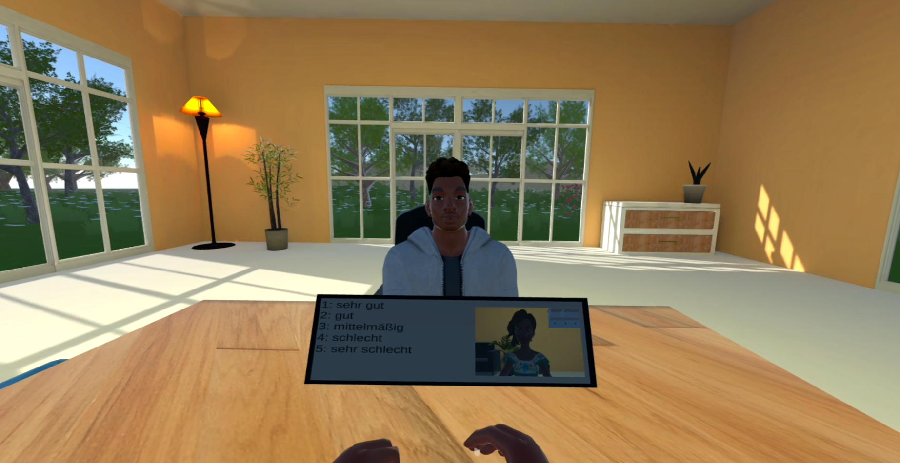
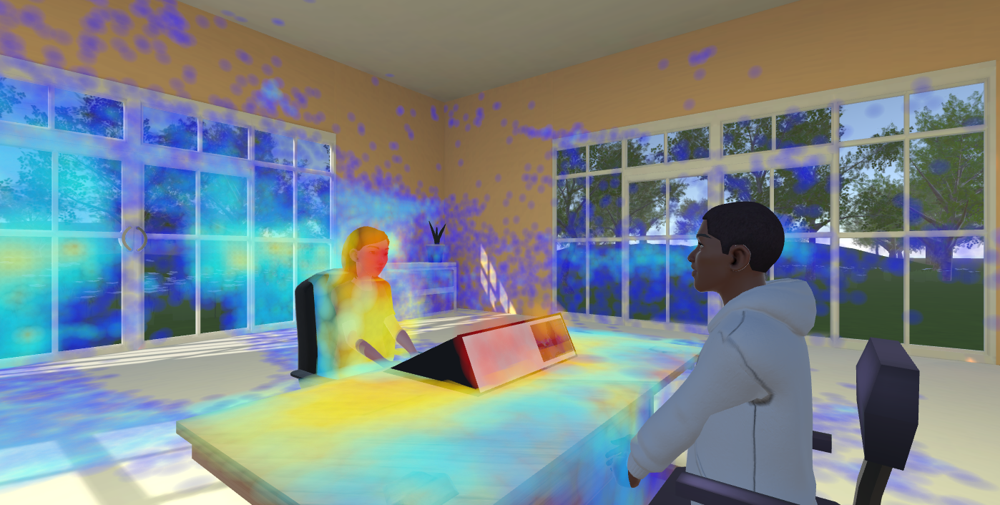

# InterView

<div class="faces-brand">
  <span class="logo--placeholder">InterView<small>logo placeholder</small></span>
  <div markdown>

**A platform for conducting survey interviews in virtual reality.**
[:material-github: Repository](https://github.com/texttechnologylab/InterView) ·
[:material-book-open-variant: Technical documentation](https://texttechnologylab.github.io/InterView/)

  </div>
</div>

An interviewee wears a VR headset and sits across from an avatar in a shared
virtual room; the interviewer sits at an ordinary web browser. A live audio and
video link connects them, the questionnaire is embedded in the environment
itself, and everything that happens (speech, gaze, posture, hand movement,
answers given) is recorded into one time-aligned dataset.
{ .lead }

<figure markdown>
  { loading=lazy }
  <figcaption>
    <strong>The interviewee's view.</strong> The answer options for the current
    item sit on a panel on the desk, numbered, with a self-view mirror at the
    right. They are never read aloud, so any spoken answer containing an index
    is evidence the participant read the interface, which
    <a href="../../studies/#answer-format">36&nbsp;% of answers did</a>.
  </figcaption>
</figure>

## Components

| | |
|---|---|
| **InterView-VR** | Unity application for Meta Quest, built on [Va.Si.Li-Lab](vasili-lab.md). Renders the room, drives the embedded questionnaire, and logs gaze, facial expression, hand and body tracking. |
| **InterView-W** | Static browser client: an interviewer console and a non-VR participant fallback. Device selection, virtual background, live chat, gaze overlay, answer-option and recording control. |
| **InterView-B** | Backend: a [Janus](infrastructure.md) SFU plus optional TURN relay, the Va.Si.Li-Lab room server, and the logging API everything is written through. |
| **InterView-P** | Post-hoc processing: Whisper transcription, gaze resolved against scene geometry, questionnaire import, and linkage into one relational dataset. |

## A session

A participant is issued a **token**. Entered in the VR client, it deterministically
derives the media room, the VR room and the questionnaire URL, so headset and
browser meet in the same place with no coordination step. The interviewer opens
the same token in a browser and joins. Recordings land on the media server; all
tracking and event data lands in the database, keyed by that same token.

Gaze is one of the channels captured this way, then replayed into the scene for
analysis; see [Studies](../studies.md#gaze) for what it shows.

<figure markdown>
  { loading=lazy }
  <figcaption>
    <strong>Gaze, portrayed.</strong> Aggregated gaze rendered back over the
    scene for a session.
  </figcaption>
</figure>

## Running it

```bash
git clone https://github.com/texttechnologylab/InterView.git
cd InterView
cp .env.example .env      # database credentials and an API key
docker compose up -d
```

!!! warning "Read the setup guide first"
    The stack requires an external database and a TLS-terminating reverse proxy,
    and will not work without them. See the
    [setup guide](https://texttechnologylab.github.io/InterView/setup/).

Full technical documentation (architecture, services, operations) is at
[texttechnologylab.github.io/InterView](https://texttechnologylab.github.io/InterView/);
Unity and VR-client documentation is in the
[Va.Si.Li-Lab docs](https://texttechnologylab.github.io/Va.Si.Li-Lab/). This page
is an overview, not a replacement for either.

## In the browser

InterView is not only a VR application. **InterView-W**, the interviewer
console and non-VR participant view listed above, runs in an ordinary browser
with no headset at all. It was not part of the published evaluation study, but
it is the interface actually in use right now.

<figure markdown>
<div class="img-placeholder" markdown>Screenshot placeholder<br><small>InterView-W browser client</small></div>
  <figcaption>
    <strong>The browser client.</strong> Device selection, live chat,
    questionnaire and recording control, usable from a laptop with no VR
    hardware. This is the interface the <strong>ongoing NEPS validation
    study</strong> is currently fielded on; see
    <a href="../project.md#approach">Approach</a>.
  </figcaption>
</figure>

See [Publications](../publications.md#how-to-cite) for how to cite it.
