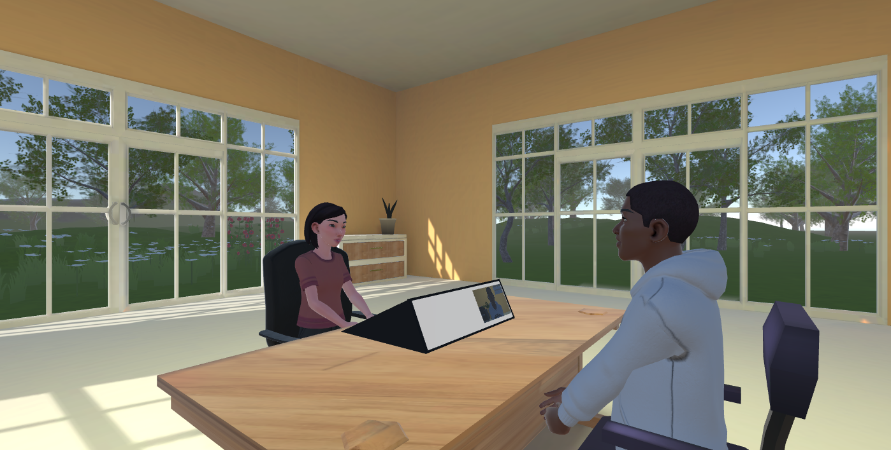

Survey research has a measurement problem it cannot see. A telephone or web
survey records the answer and nothing else: not the hesitation before it, not
where the respondent was looking, not whether they understood the question. At
the same time, conventional face-to-face interviewing is under pressure from
attrition, recruitment difficulty and rising cost.

**FACES** responds to both. It builds a multimodal data space for survey
research in which interviews are conducted between avatars in virtual reality
or over video, with the full interaction (speech, gaze, posture, facial
expression, answers and their timing) captured on a single clock and stored as
a linked, relational dataset. The environment is variable by design: avatars,
situational parameters, interfaces and AI components can all be manipulated as
experimental conditions.

The project is run jointly by the
[Text Technology Lab](https://www.texttechnologylab.org/) at Goethe University
Frankfurt and Departments 2 and 3 of the
[Leibniz Institute for Educational Trajectories (LIfBi)](https://www.lifbi.de/)
in Bamberg.

  <h2 class="faces-section__title">Three research questions</h2>
  

    FACES asks whether avatar-mediated interviewing is feasible, whether
    respondents accept it, and whether the resulting data quality holds up.
  

  

    

      01
      <h3>Avatars versus video</h3>
      
What are the advantages of avatar-based interviews compared to
      video-based interviews in terms of acceptance, feasibility and data
      quality?

    

    

      02
      <h3>Reducing interviewer effects</h3>
      
Which combinations of features reduce interviewer effects, and how do
      they interact?

    

    

      03
      <h3>Virtual interviewer training</h3>
      
How can the results be integrated into a theory for training virtual
      interviewers?

    

  

  <h2 class="faces-section__title">What has been delivered</h2>
  

    Four pieces of open-source software, two completed studies, a reproducible
    analysis pipeline and two papers. Everything below is public.
  

  

    <a class="faces-card" href="deliverables/interview/">
      Released
      <h3>InterView</h3>
      
The interview platform. VR and browser clients, a WebRTC media layer, a
      room server and a logging API, shipped as one Docker Compose stack.

      Platform &rarr;
    </a>

    <a class="faces-card" href="deliverables/vasili-lab/">
      Released
      <h3>Va.Si.Li-Lab</h3>
      
The Unity VR framework InterView is built on, together with its backend:
      scene and role definitions, the Ubiq room server and the logging API.

      Framework &rarr;
    </a>

    <a class="faces-card" href="deliverables/infrastructure/">
      Released
      <h3>Janus-Gateway</h3>
      
A pinned, reproducible build of the Janus WebRTC server, so you can
      state which software produced a dataset.

      Infrastructure &rarr;
    </a>

    <a class="faces-card" href="studies/#study-1-the-avatar-pre-study">
      Complete
      <h3>Avatar pre-study</h3>
      
99 respondents rated 20 avatars on preference, trust, comfort and
      similarity, to select the interviewer avatars used in the main study.

      Study 1 &rarr;
    </a>

    <a class="faces-card" href="studies/#study-2-the-vr-interview-study">
      Complete
      <h3>VR interview study</h3>
      
27 full interviews conducted in virtual reality across two institutions,
      with the complete multimodal record of each one.

      Study 2 &rarr;
    </a>

    <a class="faces-card" href="studies/#reproducibility">
      Complete
      <h3>Analysis pipeline</h3>
      
Every figure, table and reported number regenerates from cache with one
      command, and the prose is read back out of the written tables.

      Reproducibility &rarr;
    </a>

    <a class="faces-card" href="publications/#reemote">
      Accepted
      <h3>ReEmote</h3>
      
Emotion representation in VR through avatar facial expression. Accepted
      at XR Salento 2026, Springer LNCS.

      Publication &rarr;
    </a>

    <a class="faces-card" href="publications/#interview-paper">
      Under review
      <h3>InterView paper</h3>
      
<em>Towards a Unified VR-Capable Interview Environment</em>: the system,
      its data model, and the evaluation study. Under review at IJHCS
      (Elsevier).

      Publication &rarr;
    </a>

  

  

    
4,567,743

    

      records captured across six linked modalities in 27 interviews (eye, body
      and head tracking, audio, transcribed speech, questionnaire state and
      self-report), at a measured median of <strong>18.5&nbsp;Hz</strong> with a
      <strong>96.6&nbsp;%</strong> capture duty cycle. Not a nominal
      specification: a measurement, read back out of the stored data.
    

  

## How it works

An interviewee wears a VR headset and sits across a desk from an avatar in a
shared virtual room. The interviewer sits at an ordinary web browser. A live
audio and video link connects them, a questionnaire is embedded in the
environment itself, and everything that happens is recorded time-aligned into a
single relational dataset.

<figure markdown>
  { loading=lazy }
  <figcaption>
    <strong>The interview room.</strong> A deliberately unremarkable
    medium-sized room. The panel on the desk carries the answer options for the
    current question. It is part of the instrument, and it measurably changes
    how people answer. See <a href="studies/#answer-format">Answer format</a>.
  </figcaption>
</figure>

The approach runs in three stages. The platform was built first and is now
released; the preliminary experiments on avatar characteristics and immersion
are complete; validation with former [NEPS](https://www.neps-data.de/) panel
participants is now under way.

<figure markdown>

Screenshot placeholder <small>InterView-W, the browser client</small>

  <figcaption>
    <strong>Not headset only.</strong> Everything above describes the VR side.
    InterView also runs entirely in an ordinary browser, with no headset
    required. It was not part of the published evaluation study, but it is the
    interface the <strong>ongoing NEPS validation study</strong> is currently
    being fielded on. See
    <a href="deliverables/interview/#in-the-browser">InterView</a>.
  </figcaption>
</figure>

[Read about the project](project.md){ .md-button .md-button--primary }
[See the platform](deliverables/index.md){ .md-button }

