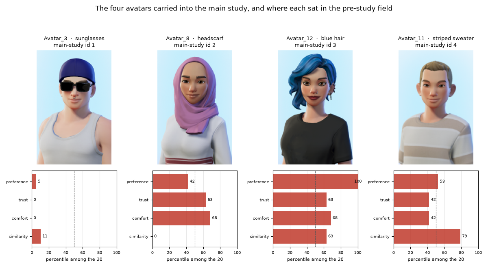
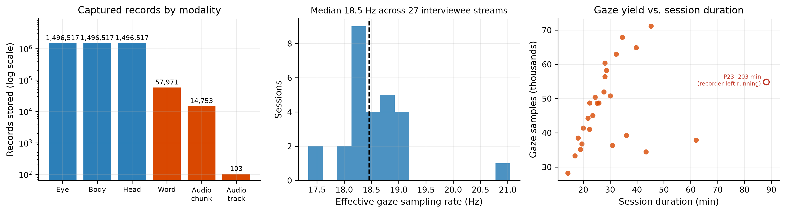
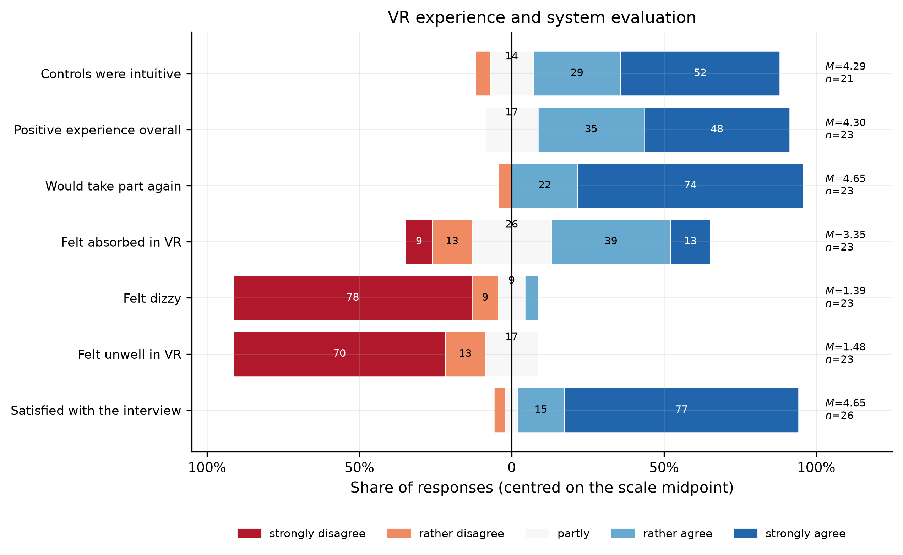

# Studies

Two studies are complete: an online pre-study that selected the interviewer
avatars, and the VR interview study that evaluated the platform.
{ .lead }

The instrument works, and it measures things a conventional survey cannot see.
The behavioural effects it reveals are real but modest at *n* = 27, and are
reported here with their confounds and their nulls intact.

---

## Study 1: The avatar pre-study

Fielded 6–24 June 2025. **99 of 115** respondents completed it, rating 20
avatars on preference, trust, comfort and similarity. None took part in the
interviews.

Four avatars went into the main study. They were **not** the four best-rated:
they were chosen to span most of the preference range, so that avatar effects
could be looked for at all.

<figure markdown>
  { loading=lazy }
  <figcaption>
    <strong>The four carried forward.</strong> Percentile among the twenty on
    each construct. The sunglasses avatar is last of twenty on both trust and
    comfort; the blue-haired avatar is the single most preferred of the field.
    Note that the high/low split holds on preference but not on the others: the
    lower-ranked headscarf avatar scores higher on trust and comfort than the
    higher-ranked striped jumper.
  </figcaption>
</figure>

!!! warning "No causal claim about avatars"
    Interviewer avatar was not randomised across the 27 interviews, and the
    interviewee set is a different, unbalanced subset. The pre-study establishes
    how the avatars were *perceived* by an independent sample; it does not
    license a causal claim in the main study.

---

## Study 2: The VR interview study

Twenty-seven interviews at two institutions. Interviewers and interviewees had
never met. Each ran about 20 minutes of questionnaire inside a median
27.7-minute session, including two personality batteries used as the
experimental contrast: **neutral** (Q~N~) and **discomfort-inducing** (Q~D~).

### What the instrument captured

<figure markdown>
  { loading=lazy }
  <figcaption>
    <strong>Measured, not specified.</strong> Records per modality; the
    <em>effective</em> gaze sampling rate across 27 interviewee streams, read
    back from timestamps rather than taken from a device datasheet; and gaze
    yield against session duration.
  </figcaption>
</figure>

| | | | |
|---|---|---|---|
| Valid interviews | **27** (of 34 recorded) | Total records stored | **4,567,743** |
| Total interview time | 15.7 h | Median gaze rate | **18.5 Hz** |
| Eye / body / head records | 1,496,517 each | Capture duty cycle | **0.966** |
| Transcribed words | 57,971 | Gaze in reference view | 97.0 % |

A duty cycle of 0.966 means capture is continuous for essentially the whole
session. This is the claim everything else rests on, and the one we can make
most firmly.

### Acceptance

<figure markdown>
  { loading=lazy }
  <figcaption>
    <strong>Post-interview self-report.</strong> Discomfort and dizziness are at
    the floor (M = 1.48 and 1.39), willingness to take part again near the
    ceiling (M = 4.65), immersion moderate (M = 3.35). Crucially these are
    independent of the interviewer's avatar and of avatar–participant matching:
    the experience is <strong>stable across conditions</strong>, which is what
    makes the environment usable as a controlled setting.
  </figcaption>
</figure>

### Answer format

**The cleanest result in the study, and the one most likely to matter
elsewhere.** The answer options were displayed on the desk panel, numbered, and
never read aloud.

  
How participants voiced a scale answer

  

    <b>Bare index</b>"three"
    
    36.3 %
  

  

    <b>Full scale label</b>"rather good"
    
    32.6 %
  

  

    <b>Both</b>index and label
    
    4.4 %
  

  

    <b>Neither</b>paraphrase or other
    
    26.8 %
  

  

    Resolved against each item's actual response-option catalogue rather than a
    single hard-coded five-point vocabulary. Bar length is proportional to share.
  

Two things follow. Since the indices were only ever *visible*, a participant
could produce one only by reading the panel and folding it into their answer:
**the interface demonstrably changes response behaviour**, and interviewers
unanimously reported that displaying the options helped the interview flow.

And **63 % of spoken answers contain no verbatim scale label**. A voice-driven
questionnaire therefore cannot match on label text; it has to resolve a bare
index against whatever scale is displayed, and fall back to a clarification turn
for the 27 % that give neither form. That constraint generalises well beyond VR.

Index usage does not differ between neutral and sensitive items (*W* = 70.0,
*p* = .758); it is a property of the interface, not of question sensitivity.

### Gaze

Gaze is resolved by replaying captured eye tracking into the Unity scene and
raycasting against the actual colliders, so "looked at the answer panel" is a
measurement rather than an inference from a 2D projection.

**Where people look barely moves.** No area-of-interest dwell shift survives
correction for multiple comparisons (*n* = 26, all Holm *p* = 1.0); the largest
raw shift is toward the window (+0.026, *p* = .162), with the answer panel,
self-view mirror and interviewer's face all essentially flat.

**How people look does move.**

| Metric | Q~N~ | Q~D~ | *p* | Holm |
|---|---|---|---|---|
| **Fixation time share (s/s)** | **0.628** | **0.583** | **.008** | **.040** |
| Mean fixation duration (s) | 0.338 | 0.289 | .029 | .117 |
| Fixations per second | 1.790 | 1.817 | .940 | 1.0 |
| Gaze dispersion (deg) | 13.14 | 14.61 | .745 | 1.0 |

Fixation time share is the one metric that survives Holm correction across the
fixation family (*d~z~* = −0.64): under sensitive questions participants spend a
smaller fraction of their time in fixation, shifting toward slightly longer,
less frequent fixations. Spatial entropy is also higher under sensitive items
(2.98 → 3.17, *p* = .018, *n* = 20): participants scan more of the scene rather
than staring more widely.

### Response latency

Sensitive items are answered 0.42 s more slowly at the median (2.73 s vs
2.31 s), but this is **not a reliable effect and the design cannot make it one**
(Mann-Whitney *p* = .210).

!!! danger "The confound, stated plainly"
    The batteries are **not interleaved**: every neutral item precedes every
    sensitive one, so item identity explains **99.3 %** of the variance in
    interview position. Question type, position and item are very nearly the same
    variable. Under participant-clustered inference neither term is reliable:
    sensitivity ×0.89 (*p* = .613), position ×1.48 (*p* = .143), with the model's
    sensitivity estimate pointing in the *opposite* direction from the raw
    comparison. We therefore claim no latency effect of either kind.
    Interleaving the batteries is the fix, and belongs in the next study.

Speech shows the same shape: responses to sensitive items run longer
(1.51 s → 2.02 s, *p* = .025), but the effect does not survive correction.

### Behaviour against self-report

The finding that most directly justifies building the instrument.

Asked directly afterwards, **only 10 of 27 respondents (37 %)** said any
question had made them uncomfortable. Those 10 differ sharply from the other 17:

| Measure | Claimed discomfort | Did not | *d* | Holm *p* |
|---|---|---|---|---|
| Δ response duration | +1.00 s | 0.00 s | 1.76 | **.0014** |
| Δ interviewer-face dwell | +0.005 | 0.000 | 0.73 | **.037** |
| Δ median latency, latency ratio, Δ mirror dwell | n/a | n/a | n/a | n.s. |

Both surviving effects are substantial. But the crucial observation is the other
half: **the same behavioural shifts appear in participants who reported no
discomfort at all.** Self-report and behaviour converge only partially, so if
those shifts index discomfort, self-report alone substantially underestimates
the impact of sensitive questions, plausibly through social-desirability
reluctance. That is precisely the gap a multimodal interview environment exists
to close.

!!! note "A separate analysis, not to be confused with this one"
    Correlating behavioural shifts against the five post-interview Likert items
    gives 25 rank correlations, **none** of which survive Holm correction. At
    *n* = 27 the intervals are wide enough to contain moderate effects, so that
    is an *absence of demonstrated convergence*, not demonstrated independence:
    a different question from the group comparison above.

---

## Reproducibility

Every figure and number here comes from an analysis package that regenerates end
to end in about a minute (`python run_all.py`). Only the cache-building step
touches the network; everything downstream is offline and deterministic, and a
clean rebuild reproduces every reported number exactly. The package's summary
document is written by reading results back out of the generated tables, so the
prose cannot drift from the data.

## Limitations

- **n = 27.** Intervals are wide; directional results should be read as directional.
- **Fixed battery order** makes question type and time-on-task inseparable here.
- **Interviewer avatar was not randomised**, so no causal avatar claim is made.
- **Transcription is imperfect**, which affects the "neither" answer-format
  category and under-detects filled pauses.
- **Interviewer gaze is captured but not analysed.** It projects into the
  interviewee's reference view for a median of about 1 % of samples, and needs
  its own reference geometry.

Full detail is in the [InterView paper](publications.md#interview-paper).
